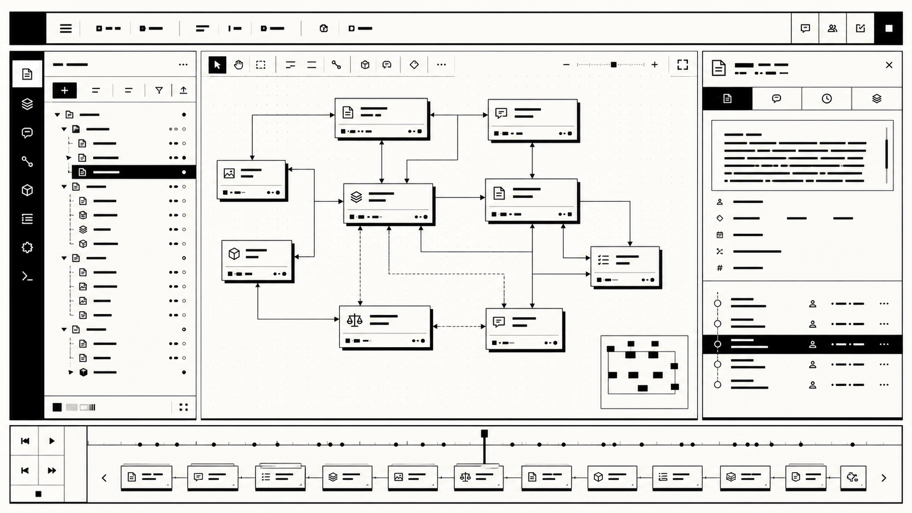
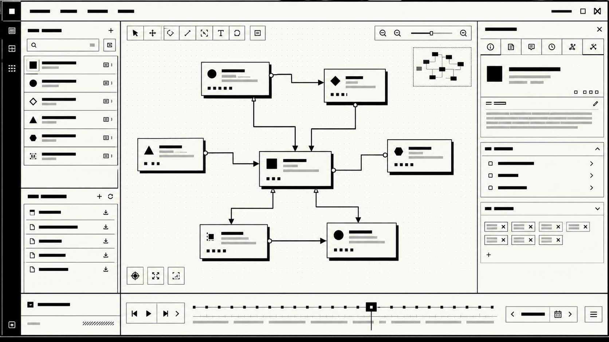
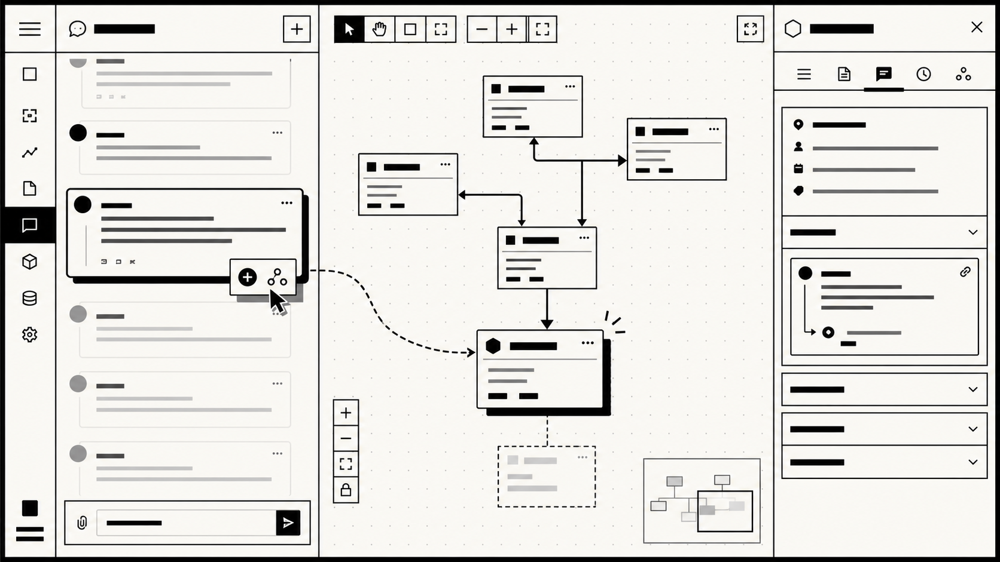
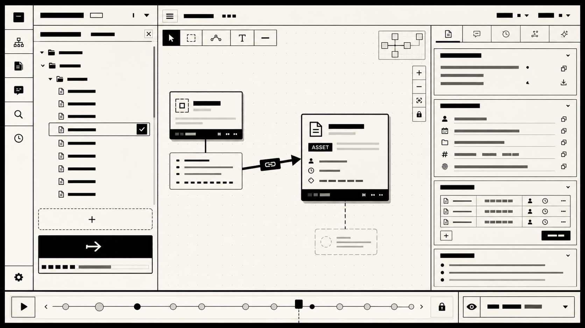
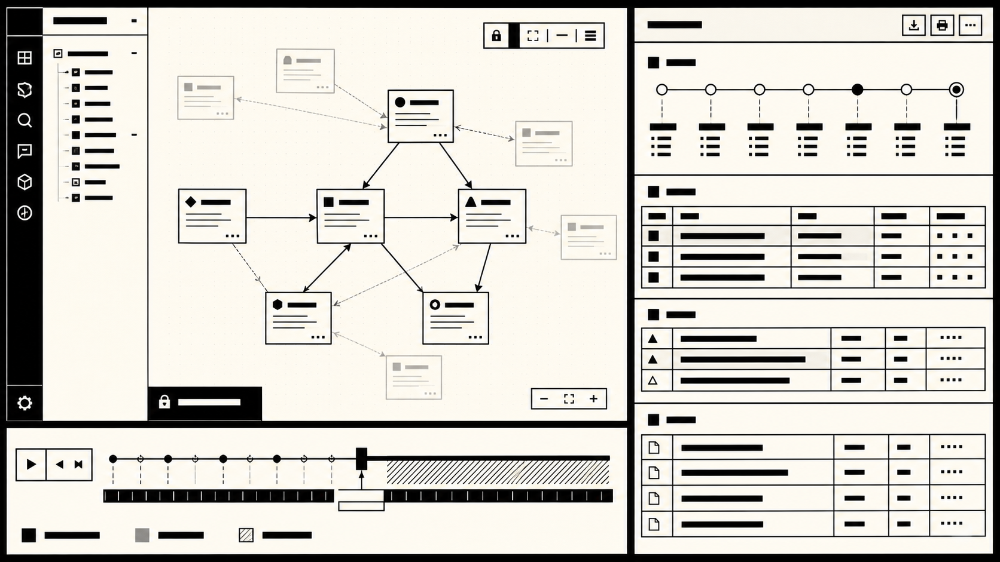

# CORETEX

**CORETEX is a visual prototype for a node-based collaborative document system.**

It explores a product direction where project work is not organized as linear folders, isolated documents, or detached chat history. Instead, documents, messages, versions, decisions, tags, and local file assets are represented as **Traceable Work Nodes** inside a directed decision graph.

[한국어 README](docs/ko/README.md)



## What This Is

CORETEX is currently a runnable interaction prototype, not a production SaaS.

The prototype is meant to validate the core product idea:

> Can a team trace where a final output came from, which drafts and conversations shaped it, and what evidence still supports the decision?

The current app demonstrates that flow through a monochrome brutalist workspace: graph canvas, node inspector, document editor, chat layer, time-travel bar, archive report, and local file import.

## Tags

`typescript` · `react` · `nextjs` · `knowledge-graph` · `information-visualization` · `local-first` · `markdown` · `llm` · `document-management` · `collaboration` · `react-flow` · `zustand`

These tags follow the direction used across my public repositories: graph interfaces, local-first workflows, knowledge tools, markdown-based systems, and AI-assisted context extraction.

## Demo Checklist

After starting the dev server, open:

```text
http://localhost:3000/app/w/workspace_demo/p/project_demo/flow
```

In the demo, you can verify:

- **Graph workspace**: context nodes rendered as a directed genealogy graph.
- **Node selection**: click a node to inspect metadata, document content, chat, versions, genealogy, and AI suggestions.
- **Node creation**: create an `IDEA`, `BRIEF`, `RESEARCH`, `DRAFT`, `DECISION`, `ASSET`, or `FINAL` node.
- **Edge creation**: connect nodes with semantic relationships such as `SUPPORTS`, `REFINES`, `REFERENCES`, or `DECIDES`.
- **Cycle rejection**: the API blocks graph edges that would break the DAG.
- **Document editing**: edit a node document in the TipTap editor and save immutable versions.
- **Version restore**: open old versions and restore them as new versions.
- **Project chat**: create project-level messages.
- **Node chat**: create messages scoped to the selected node.
- **Message-to-node**: turn a chat message into a new traceable node.
- **Manual linking**: manually link a message to the active node.
- **Fallback AI extraction**: use `#tags`, `@node-title` mentions, and decision phrases to trigger semantic suggestions without an API key.
- **Document extraction**: saved document text can produce tags and relationship suggestions.
- **Local file import**: import text/Markdown files from `data/local-library/project_demo` as `ASSET` nodes.
- **Document search**: search across node titles, summaries, document body text, messages, tags, and decisions.
- **Time travel**: move the bottom timeline to inspect a past graph state in read-only mode.
- **Archive report**: generate a read-only project archive with genealogy, decisions, final outputs, messages, tags, and source files.

Archive view:

```text
http://localhost:3000/app/w/workspace_demo/p/project_demo/archive
```

## Visual Prototype Tour

### 1. Graph Workspace

The main screen is built around the decision genealogy graph: nodes represent traceable units of work, edges represent semantic relationships, and the inspector keeps document, chat, version, genealogy, and AI context in one place.



### 2. Message To Node

Chat is not treated as a disposable side channel. In the demo, a project or node-scoped message can be linked to an existing node or promoted into a new Traceable Work Node.



### 3. Local Files To Asset Nodes

The local file library is the prototype bridge for file/folder context. Supported text assets can be imported as `ASSET` nodes and connected back into the graph.



### 4. Time Travel And Archive

The time-travel bar reconstructs a past graph state in read-only mode. The archive view turns the current project graph into a structured report with decisions, final outputs, discarded alternatives, messages, tags, and source files.



## Local File Library

The prototype includes a local file/folder bridge:

```text
data/local-library/<projectId>/
```

Demo files:

```text
data/local-library/project_demo/briefs/launch-brief.md
data/local-library/project_demo/research/context-loss-notes.txt
```

Supported text assets can be imported from the `Local Files` panel. Imported files become `ASSET` nodes, keep source metadata, and are included in archive output. If a graph node is selected during import, CORETEX creates a `REFERENCES` edge from that node to the imported asset.

## Product Model

The prototype centers on one object:

**Traceable Work Node**

A node should answer:

- who created this unit of work
- when it was created
- what it contains
- where it came from
- what it caused
- which messages and files support it
- what version history it carries
- whether it became part of a decision path

This is why CORETEX is framed as a context graph, not a file manager or whiteboard.

## Stack

- Next.js App Router
- React
- TypeScript
- Tailwind CSS
- React Flow
- Zustand
- TanStack Query
- TipTap
- Zod
- Prisma schema and migrations for PostgreSQL
- In-memory local demo store for runnable prototype mode

## Run Locally

```bash
npm install
npm run dev -- --port 3000
```

Useful routes:

```text
http://localhost:3000/auth/sign-in
http://localhost:3000/app
http://localhost:3000/app/w/workspace_demo/p/project_demo/flow
http://localhost:3000/app/w/workspace_demo/p/project_demo/archive
```

## Verify

```bash
npm run test
npx tsc --noEmit
npm run build
npx prisma validate
npm run prisma:generate
npm run seed
npm audit --json
```

`npm run build` uses `next build --webpack` because Next 16 Turbopack build attempts an internal port bind that is blocked in this sandbox.

## Data Layer

The repository includes Prisma models and SQL migrations for a PostgreSQL-backed product shape:

```text
prisma/schema.prisma
prisma/migrations/0001_init/migration.sql
prisma/migrations/0002_file_assets/migration.sql
```

For local prototype execution, the app uses `lib/mock-db.ts`. That keeps the visual prototype runnable without setting up PostgreSQL, NextAuth, object storage, pgvector, or third-party integrations.

## Current Boundaries

Implemented as prototype behavior:

- graph workspace
- node and edge CRUD
- document versions
- scoped chat
- message-node linking
- message-to-node creation
- fallback semantic extraction
- local file import
- search
- time-travel view
- archive generation
- usage guard scaffolding

Not implemented as production infrastructure:

- real NextAuth provider setup
- PostgreSQL persistence at runtime
- real-time collaborative editing
- Slack, Figma, Google Drive, or S3 sync
- pgvector search
- Stripe billing
- organization SSO
- production deployment hardening

## License

This repository is **not open source**.

Copyright (c) 2026 Taewoo Park. All rights reserved.

See [LICENSE](LICENSE).
