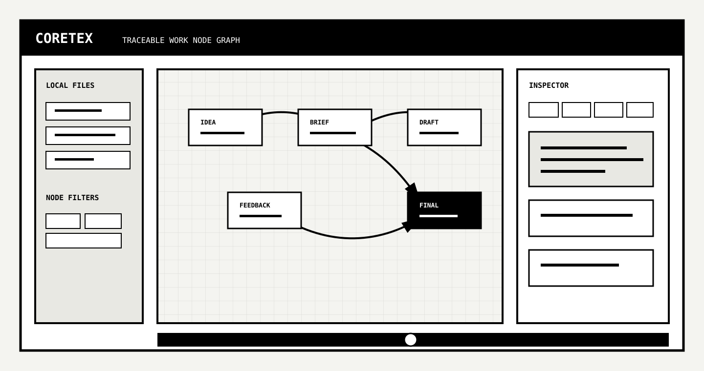
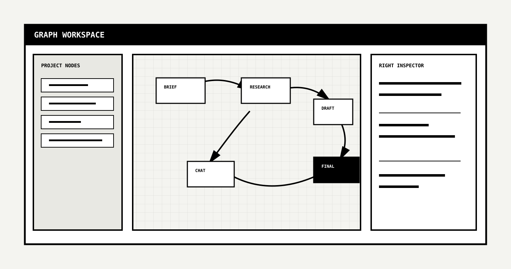
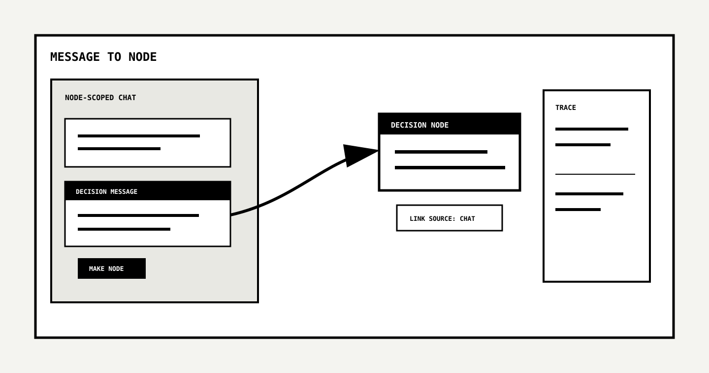
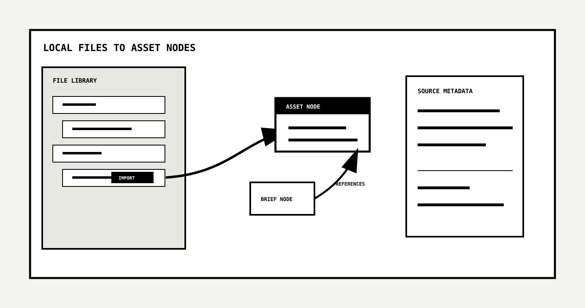
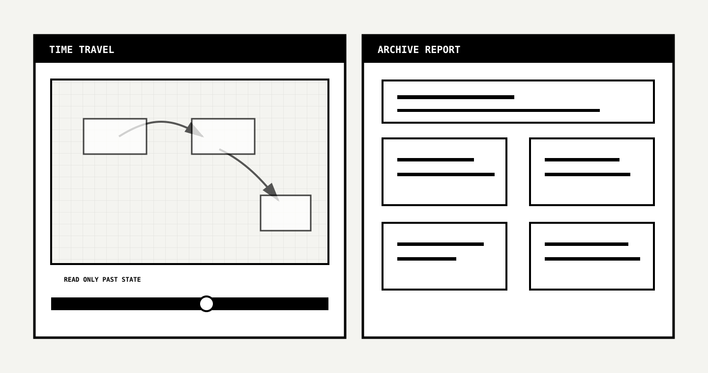

<h1 align="center">CORETEX</h1>

<p align="center">
  <strong>추적 가능한 협업 문서를 위한 비주얼 프로토타입.</strong><br />
  문서, 채팅, 버전, 의사결정, 로컬 파일을 방향성 의사결정 계보 그래프로 다룹니다.
</p>

<p align="center">
  
  
  
  
</p>

<p align="center">
  
  
  
  
  
  
  
  
</p>

<p align="center">
  <a href="../../README.md">English README</a> ·
  <a href="https://github.com/TaewoooPark/NODEPROMPT">NODEPROMPT</a> ·
  <a href="https://github.com/TaewoooPark/PAIDEIA">PAIDEIA</a> ·
  <a href="https://taewoopark.com">taewoopark.com</a>
</p>

<p align="center">
  
</p>

<p align="center">
  <em>"문자는 기억이 아니라 상기(想起)만을 줄 뿐이다."</em><br />
  — 플라톤, 『파이드로스』 275a
</p>

## Why CORETEX

2,500년 전 플라톤은 살아 있는 기억(*mnēmē*)과 글이 남기는 외부적 상기(*hypomnēsis*)를 구분했습니다. 완성된 문서는 그 상기입니다. 문서를 만들어낸 사고 — 폐기된 초안들, 한 갈래를 닫아버린 대화, 아이디어를 결정으로 바꿔놓은 논쟁 — 는 파일이 저장되는 순간 거의 항상 사라집니다.

대부분의 협업 도구는 이 손실을 자연스러운 사실로 받아들입니다. 산출물은 보존하지만 사고는 보존하지 못합니다. 파일 트리는 무엇이 존재하는지 보여주고, 채팅 로그는 사람들이 대화했다는 사실을 보여주고, 보드는 일이 이동했다는 사실을 보여줍니다. 하지만 최종안이 **왜** 존재하는지, **어떤** 폐기안이 지금 방향을 만들었는지, 새 팀원이 **어디서부터** 읽어야 하는지는 안정적으로 답하지 못합니다.

CORETEX는 이 손실을 형이상학적 한계가 아니라 공학적으로 풀 수 있는 문제로 다룹니다. 프로젝트 업무를 선형적인 파일의 나열이 아니라 가정, 근거, 수정, 논쟁, 결정, 폐기된 대안이 이어진 방향성 계보 — 의미 있는 작업 단위가 *Traceable Work Node*가 되는 **의사결정 계보 그래프** — 로 모델링합니다. 최종 문서는 더 이상 유일한 산출물이 아니라, 제품이 끝까지 걸어다닐 수 있게 유지하는 인과 사슬의 가시적인 끝일 뿐입니다.

이 문제는 폐기된 갈래도 지식인 곳에서 특히 큽니다. 스타트업의 방향 전환, 연구팀의 가설과 실패한 실험, 디자인 피드백, 전략 문서, 제품 의사결정, 팀 간 인수인계에서는 결정 자체보다 결정의 *이유*를 잃는 비용이 더 클 수 있습니다.

## 비주얼 프로토타입

CORETEX는 production SaaS가 아니라 실행 가능한 비주얼 프로토타입입니다. 현재 데모는 그래프 워크스페이스, 노드 인스펙터, 문서 편집기, scoped chat, 버전 기록, 로컬 파일 import, 검색, 타임트래블, 아카이브 생성을 통해 위 전제를 구체적으로 검증합니다. 검증하려는 질문은 하나입니다.

> 최종 결과물이 어디서 시작됐고, 어떤 초안과 대화와 근거를 거쳐 지금 상태가 됐는지 팀이 빠르게 추적할 수 있는가?

## CORETEX가 주목하는 것

| 관찰 | 제품적 귀결 |
| --- | --- |
| 맥락은 장식이 아니라 인과입니다. | 작업을 느슨한 폴더나 독립 페이지가 아니라 방향성 노드 관계로 모델링합니다. |
| 최종 산출물에는 조상이 있습니다. | `IDEA`, `RESEARCH`, `DRAFT`, `FEEDBACK`, `DECISION`, `ASSET`, `FINAL` 노드가 의사결정 계보를 이룹니다. |
| 대화는 근거입니다. | 채팅 메시지는 노드에 붙거나, 제안을 만들거나, 새 노드로 승격될 수 있습니다. |
| 버전은 덮어쓰기 소음이 아니라 기억입니다. | 문서 버전은 immutable하게 저장되고 새 버전으로 복원될 수 있습니다. |
| 폐기된 대안도 최종안을 설명합니다. | 타임트래블과 아카이브가 현재 이전에 존재했던 상태를 보존합니다. |
| AI는 팀 대신 결정하지 않아야 합니다. | AI는 태그, 관련 노드, 후보 edge, 요약, 명시적 결정 문장만 추출합니다. |
| 시각적 형태는 사고 방식을 바꿉니다. | 조밀한 브루탈리즘 모노톤 UI로 구조, 대비, 계보가 계속 보이게 합니다. |

프로토타입의 범위 기준은 단순합니다. 어떤 기능이 프로젝트의 맥락, 계보, 결정 이유, 버전 흐름을 더 잘 추적하게 만든다면 핵심에 가깝습니다. 단지 CORETEX를 또 다른 파일 관리자, 화이트보드, 채팅 껍데기처럼 보이게 하는 기능이라면 부차적입니다.

## 데모 실행

**요구 사항**: Node.js 20 이상 (Next.js 16). 별도의 데이터베이스가 필요 없습니다. 프로토타입은 첫 요청 시점에 데모 워크스페이스/프로젝트를 자동 시드(seed)하는 in-memory mock store 위에서 동작합니다.

```bash
git clone https://github.com/TaewoooPark/Coretex.git
cd Coretex
npm install
npm run dev
```

브라우저에서 [`http://localhost:3000`](http://localhost:3000) 을 엽니다. 홈 라우트가 데모 유저로 자동 로그인시킨 뒤 워크스페이스 선택 화면으로 리다이렉트합니다. seed된 **CORETEX Demo** 워크스페이스 → **Project Demo** 프로젝트 → **Flow** 탭을 차례로 열면 됩니다.

개발 서버가 떠 있을 때 바로 들어갈 수 있는 딥링크:

```text
http://localhost:3000/app/w/workspace_demo/p/project_demo/flow
http://localhost:3000/app/w/workspace_demo/p/project_demo/archive
```

### 선택 환경 변수

아래는 전부 옵션입니다. 아무것도 설정하지 않아도 데모는 동작합니다.

| 변수 | 설정 시 효과 |
| --- | --- |
| `OPENAI_API_KEY` | `lib/ai/extractContext.ts`의 OpenAI 호출 경로를 활성화합니다. 없으면 `#tag`, `@node-title`, 결정 문장 패턴 기반의 결정적 로컬 추출기로 fallback 됩니다. |
| `OPENAI_MODEL` | 추출기에 쓰이는 모델(`gpt-4o-mini`)을 override 합니다. |
| `CORETEX_LOCAL_LIBRARY_ROOT` | 로컬 파일 패널이 스캔하는 경로(`data/local-library`)를 override 합니다. |
| `DATABASE_URL` | `prisma` CLI 명령(`npx prisma validate`, `npm run prisma:generate`, `npm run seed`)에서만 사용됩니다. 실행 중인 앱은 이 값을 읽지 **않습니다**. |

Prisma 관련 명령을 쓰기 전에는 `.env.example`을 복사하세요.

```bash
cp .env.example .env
```

## 데모에서 확인 가능한 것

| 영역 | 확인 가능한 내용 |
| --- | --- |
| Graph workspace | `IDEA`, `BRIEF`, `RESEARCH`, `DRAFT`, `DECISION`, `ASSET`, `FINAL` 노드가 방향성 계보 그래프로 표시됩니다. |
| Node inspector | 선택한 노드에 메타데이터, 문서 본문, 채팅, 버전, 계보, AI 제안이 붙어 있습니다. |
| Edge model | `SUPPORTS`, `REFINES`, `REFERENCES`, `DECIDES` 관계를 만들 수 있고, DAG를 깨는 edge는 거부됩니다. |
| Document editing | TipTap 문서 편집, immutable version 저장, 예전 버전을 새 버전으로 복원하는 흐름을 확인할 수 있습니다. |
| Scoped chat | 프로젝트 전체 채팅과 노드 scoped 채팅, message-node 수동 연결, message-to-node 생성을 확인할 수 있습니다. |
| Fallback extraction | API key 없이도 `#tag`, `@node-title`, 결정 문장 패턴에서 의미 제안이 생성됩니다. |
| Local files | `data/local-library/project_demo` 아래의 텍스트/Markdown 자료를 `ASSET` 노드로 import할 수 있습니다. |
| Search | 노드 제목, 요약, 문서 본문, 메시지, 태그, 의사결정을 검색할 수 있습니다. |
| Time travel | 하단 타임라인으로 과거 그래프 상태를 읽기 전용으로 재구성할 수 있습니다. |
| Archive | 계보, 결정, 최종 산출물, 폐기안, 메시지, 태그, 소스 파일을 포함한 읽기 전용 리포트를 생성합니다. |

## 비주얼 둘러보기

### Graph Workspace

메인 캔버스는 업무를 방향성 의사결정 그래프로 다룹니다. 노드는 추적 가능한 업무 단위이고, edge는 한 작업이 다른 작업으로 이어진 이유를 보존합니다.

<p align="center">
  
</p>

### Message To Node

채팅은 사라지는 보조 채널이 아니라 근거가 되는 맥락입니다. 프로젝트 또는 노드 scoped 메시지를 기존 노드에 연결하거나 새 Traceable Work Node로 승격할 수 있습니다.

<p align="center">
  
</p>

### Local Files To Asset Nodes

로컬 파일 라이브러리는 폴더 맥락을 데모 안으로 가져오는 프로토타입 브릿지입니다. 지원되는 텍스트 자료는 `ASSET` 노드가 되고 source metadata를 유지합니다.

<p align="center">
  
</p>

### Time Travel And Archive

타임라인은 과거 그래프 상태를 재구성합니다. 아카이브 화면은 현재 그래프를 구조화된 프로젝트 메모리로 바꿉니다.

<p align="center">
  
</p>

## 제품 모델

핵심 객체는 **Traceable Work Node**입니다. 노드는 다음 질문에 답해야 합니다.

| 질문 | 프로토타입 지원 |
| --- | --- |
| 누가 만들었는가? | 노드 메타데이터와 메시지 작성자. |
| 무엇을 담고 있는가? | 제목, 요약, 타입, 태그, 문서 본문, 연결된 파일. |
| 어디에서 파생되었는가? | incoming semantic edge와 source chat/file reference. |
| 무엇을 야기했는가? | outgoing semantic edge와 downstream final output. |
| 어떤 근거가 있는가? | scoped message, import asset, document version. |
| 어떻게 바뀌었는가? | immutable document version과 restore flow. |
| 의사결정에 영향을 줬는가? | `DECISION` 노드, `DECIDES` edge, archive section. |

그래서 CORETEX는 파일 관리자, 화이트보드, 채팅 wrapper가 아니라 context graph로 설계되었습니다.

## 기술 스택

| 레이어 | 도구 |
| --- | --- |
| App | Next.js App Router, React, TypeScript |
| Interface | Tailwind CSS, React Flow, TipTap |
| State and data | Zustand, TanStack Query, Zod |
| Product schema | PostgreSQL을 위한 Prisma model과 SQL migration |
| Prototype runtime | `lib/mock-db.ts`의 in-memory local demo store |

## 로컬 파일 라이브러리

프로토타입은 아래 경로를 읽습니다.

```text
data/local-library/<projectId>/
```

데모 파일:

```text
data/local-library/project_demo/briefs/launch-brief.md
data/local-library/project_demo/research/context-loss-notes.txt
```

`Local Files` 패널에서 지원되는 텍스트 자료를 import하면 CORETEX는 `ASSET` 노드를 만들고 source metadata를 저장하며 archive에도 파일을 포함합니다. 다른 그래프 노드가 선택된 상태에서 import하면 선택 노드에서 asset 노드로 `REFERENCES` edge가 생성됩니다.

## 프로토타입 범위

CORETEX는 단일 사용자용 비주얼 프로토타입입니다. 데이터는 `data/local-library/project_demo`에서 seed된 in-memory 데모 store에 저장되므로 새로고침하면 알려진 초기 상태로 돌아가며, 외부 서비스 연결이 필요 없습니다. 인증, 실시간 공동 편집, 외부 통합(Slack, Figma, Drive, S3), 벡터 검색, 결제는 의도적으로 범위 밖입니다. `prisma/`의 제품 스키마는 참고용 형태이고 실시간 런타임이 아닙니다.

## 라이선스

이 repository는 공개되어 있지만 **open source가 아닙니다**.

Copyright (c) 2026 Taewoo Park. All rights reserved. [LICENSE](../../LICENSE)를 확인하세요.

## Connect

<p align="center">
  <a href="https://github.com/TaewoooPark"></a>
  <a href="https://x.com/theoverstrcture"></a>
  <a href="https://www.linkedin.com/in/taewoo-park-427a05352"></a>
  <a href="https://www.instagram.com/t.wo0_x/"></a>
  <a href="https://taewoopark.com"></a>
  <a href="mailto:ptw151125@kaist.ac.kr"></a>
</p>
